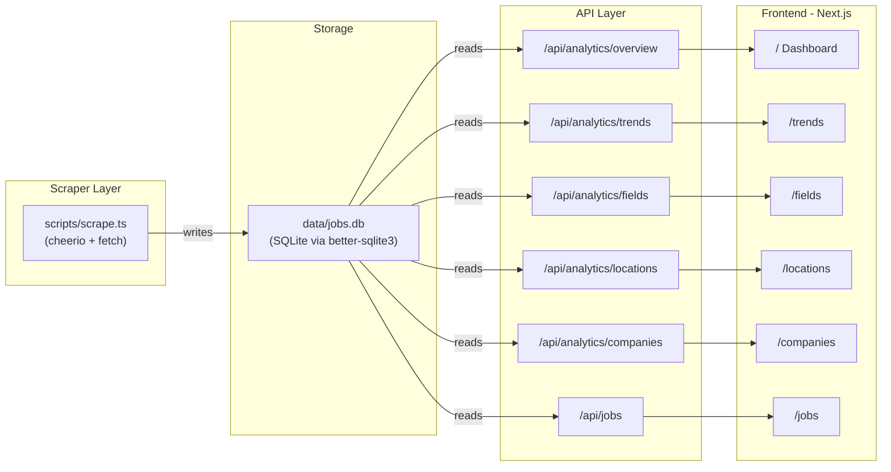

# Kenya Job Market Analyzer

## Architecture



## Tech Stack (Unified TypeScript)

- **Scraper**: `cheerio` for HTML parsing, built-in `fetch` for HTTP
- **Database**: `better-sqlite3` (file-based SQLite, zero config)
- **Charts**: `recharts` for interactive data visualizations
- **Frontend**: Next.js 16 + React 19 + Tailwind CSS 4 (already initialized)
- **Runner**: `tsx` to execute scraper scripts directly

## 1. Database Schema (`src/lib/db.ts`)

Single `jobs` table with all extracted fields:

- `id` (INTEGER PRIMARY KEY)
- `slug` (TEXT UNIQUE) -- for deduplication
- `url`, `title`, `company`
- `field`, `location`, `experience`, `qualification`, `job_type`
- `description`, `posted_date`, `deadline`
- `industry`, `scraped_at`

Plus a `scrape_runs` table to track scraping history.

## 2. Scraper (`scripts/scrape.ts`)

Two-phase approach:

- **Phase 1 - List scrape**: Crawl paginated listing pages (`/page/1`, `/page/2`, ...) extracting job URLs, titles, companies, and dates. Continue until no more pages.
- **Phase 2 - Detail scrape**: Visit each job URL to extract structured metadata (field, location, qualification, experience, job type, description, industry).
- Rate-limited with 1-2s delays between requests.
- Idempotent: skips jobs already in DB (by slug).
- Run via `npm run scrape`.

Key data from the site per job detail page:

- Job Field (e.g., "Finance / Accounting / Audit")
- Location (e.g., "Busia, Eldoret, Kisumu")
- Experience (e.g., "1 year")
- Qualification (e.g., "BA/BSc/HND, Diploma")
- Job Type (e.g., "Full Time, Onsite")

## 3. API Routes (Next.js Route Handlers)

- `GET /api/jobs` -- Paginated job listing with field/location/type filters
- `GET /api/analytics/overview` -- Total jobs, unique companies, date range, top field/location
- `GET /api/analytics/trends` -- Jobs posted per week/month over time
- `GET /api/analytics/fields` -- Count by job field
- `GET /api/analytics/locations` -- Count by location
- `GET /api/analytics/companies` -- Top hiring companies ranked by job count

## 4. Frontend Pages

All pages share a sidebar/top-nav layout with dark/light mode support.

- `**/` (Dashboard): KPI cards (total jobs, companies, fields, locations) + small summary charts (top fields bar chart, recent posting trend line)
- `**/trends`: Time-series line charts showing posting volume over time, filterable by field. Weekly and monthly views.
- `**/fields`: Horizontal bar chart of jobs per field + sortable table with counts
- `**/locations`: Bar chart of jobs by Kenyan county/city + sortable table
- `**/companies`: Ranked list of top hiring companies with job counts and sparklines
- `**/jobs`: Searchable, filterable table of all scraped jobs with pagination

## 5. Dependencies to Install

```
npm install better-sqlite3 cheerio recharts
npm install -D @types/better-sqlite3 tsx
```

## 6. Documentation

A succinct `DOCS.md` covering: project purpose, architecture, how to run the scraper, how to start the dev server, and what each page shows.

## File Structure

```
scripts/
  scrape.ts            -- Standalone scraper script
src/
  lib/
    db.ts              -- SQLite connection + schema init
    scraper.ts         -- Scraping logic (list + detail)
  app/
    layout.tsx         -- Shared layout with sidebar nav
    page.tsx           -- Dashboard
    trends/page.tsx    -- Trends analysis
    fields/page.tsx    -- Fields breakdown
    locations/page.tsx -- Locations breakdown
    companies/page.tsx -- Companies ranking
    jobs/page.tsx      -- Job browser
    api/
      jobs/route.ts
      analytics/
        overview/route.ts
        trends/route.ts
        fields/route.ts
        locations/route.ts
        companies/route.ts
  components/
    Sidebar.tsx
    KpiCard.tsx
    charts/             -- Reusable chart wrappers
data/
  jobs.db              -- SQLite database (gitignored)
DOCS.md
```
